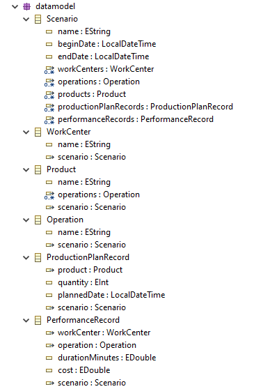

# Модель данных

Модель данных описывает структуру исходных данных для планирования.

Мастер-данные: 
- ПЦ (WorkCenter);
- производимая продукция, технология производства (Product);
- операции (Operation);
- записи о длительности/возможности выполнения операций (PerformanceRecord).

Транзакционные данные: 
- производственные заказы (ProductionPlanRecord).

**Сценарий** – это объект-контейнер, он содержит исходные данные для планирования.

По одной и той же модели данных можно создать несколько сценариев, каждый может храниться в отдельном Excel-файле.

Приложение рассчитывает на то, что структура сценария, читаемого из внешнего Excel-файла, соответствует модели данных.
