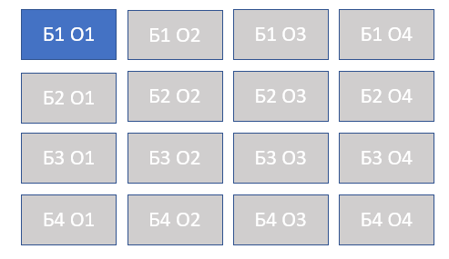
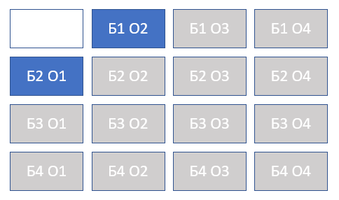
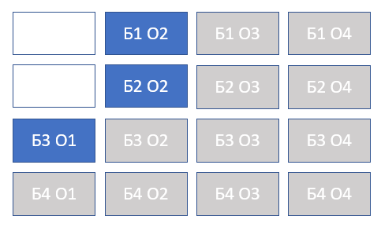
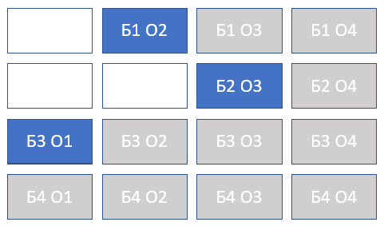

# Класс Pointer

## Основная идея идея класса Pointer

Предназначен для уменьшения количества альтернатив при производстве нескольких однотипных изделий.

Например, если мы делаем 100 однотипных изделий, то, начиная строить расписание, могли бы сгенерировать альтернативы
для первой операции первого изделия, первой операции второго изделия, и т.д.

Однако, поскольку изделия равнозначны, не имеет значения, какое из ста изделий (однотипных) начинать делать первым.

Следствие: можем всегда начинать построение расписания с размещения слота *для первой операции первого изделия* и не пытаться запланировать первую операцию для 2..100 изделия до тех пор, пока не запланировали её для первого изделия.

Выгода: кол-во альтернатив на первом шаге планирования сокращается в N раз, где N - количество однотипных изделий.

**Создавать Pointer** нужно в двух случаях:
- для первой операции первого изделия - в начале планирования;
- для первой операции k-го изделия - когда удалось запланировать первую операцию для k-1 изделия.

## Пример работы (одной картинкой)

## Пример работы (подробный)

Начальное положение: один Pointer, указывает на первую операцию первого изделия. Только эту операцию можно сейчас планировать.

Удалось запланировать операцию "Б1 О1". 
Создан новый Pointer - указывает на "Б2 О1", а прежний Pointer сдвинут вправо, на операцию "Б1 О2":

Удалось запланировать операцию "Б2 О1". 
Создан новый Pointer - указывает на "Б3 О1", а прежний Pointer сдвинут вправо, на операцию "Б2 О2":

Удалось запланировать операцию "Б2 О2". 
Pointer сдвинут вправо, на операцию "Б2 О3", новый Pointer не создан:

