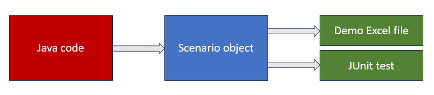

# Кодогенерация сценариев

Сценарий - это java-объект с исходными данными для планирования.
Сценарий можно сохранить в файл и прочитать из файла.

Виды сценариев, о которых далее поговорим:
- демонстрационные;
- тестовые.

(Сценарии с боевыми данными, которые заполняет заказчик - не рассматриваем).

## Проблема: сопровождение файлов сценариев

В ходе разработки модель данных часто изменяется.

Как только внесено существенное изменение (переименование поля, переименование класса) - файлы демо и тестовых сценариев нужно обновить вручную,
чтобы они могли быть прочитаны приложением.

## Решение: кодогенерация

Суть:
1. Данные сценария хранятся в виде java-кода, который работает через "прослойку" - объект `ScenarioFactory`.
2. В любой момент файл сценария может быть сгенерирован - достаточно запустить java-код.
3. Если модель данных изменилась - в большинстве случаев достаточно адаптировать класс `ScenarioFactory` и затем сгенерировать сценарии, сколько бы их ни было (п. 2).

Применение:
1. Для демо-сценариев: есть java-код, запустив который, мы получаем Excel-файлы сценариев, полностью соответствующие актуальной модели данных.
2. Для тестовых сценариев: java-код создания тестовых сценариев создаёт объект сценария, не пишет его в файл (т.к. это не требуется для выполнения тестирования логики).

## ПРАКТИКА: Новый юнит-тест

См. класс `ScheduledOperationsTest`.

1. Модификация java-кода создания тестового сценария.
2. Запуск юнит-теста по обновлённому сценарию.

## ПРАКТИКА: Новый демонстрационный сценарий

См. класс `ScenarioGenerator`.

1. Модификация java-кода создания демо-сценариев.
2. Генерация файлов сценариев.

